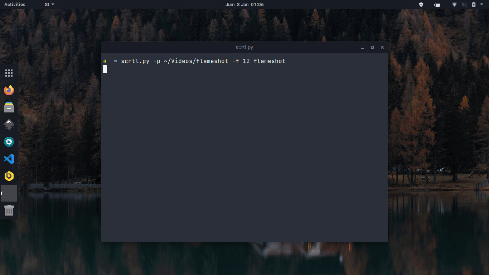

<p align="center">
  
</p>
<h2 align="center" style="font-size: 3em"><strong>scrtl</strong></h2>
<p align="center">simple script to record your screen and generate timelapse</p>

---

`scrtl` use ffmpeg to generate captured image to mp4 video, now `scrtl` support 3 application to capture your screen.

- [grim](https://github.com/emersion/grim) - Intended to use with **wayland** but **not gnome-wayland**
- [maim](https://github.com/naelstrof/maim) - intended to use with X11
- [flameshot](https://github.com/flameshot-org/flameshot) - I use this in my workspace because grim is not supported in gnome-wayland

## Usage
```text
usage: scrtl [-h] [-f NUM] [-d NUM] [-p PATH] [-s INT] tool

Create screen timelapse

positional arguments:
  tool                  App to capture your screen

optional arguments:
  -h, --help            show this help message and exit
  -f NUM, --fps NUM     FPS for generated video
  -d NUM, --delay NUM   Delay between each capture
  -p PATH, --path PATH  Path to save captured image and generated video
  -s INT, --start INT   Number where the count to start no effect in flameshot
```
| flag    | short | type | description                                                      | default              |
| ---     | ---   | ---  | ---                                                              | ---                  |
| --fps   | -f    | INT  | Set fps for generated video                                      | 24                   |
| --delay | -d    | INT  | Delay between screenshot                                         | 5                    |
| --path  | -p    | Path | Set where to save captured image and generated video             | `$HOME/Videos/scrtl` |
| --start | -s    | INT  | Number screenshot counting start, no effect if using `flameshot` | 1                    |

## Roadmap
- [ ] Auto clear captured image
- [ ] select screen to record

_suggestions welcome_

## Note
**Known Issue:**
Generated video cannot direct share in some social media like: Instagram, Whatsapp Status. You need to edit and convert it.

**Tested on:**
- Manjaro Gnome 20.2.1 Nibia (flameshot)
- Manjaro 20.2.1 Nibia + swaywm (grim)
